# Code Documentation

This section provides a detailed technical reference for the backend data models. All models inherit from our base utility classes to ensure data consistency.

## API Manual

This page contains all necesary documentation about API endpoints:
[API Documentation](https://moviesxmovies.jonaykb.com/api/docs/)

## Architecture Overview

The following diagram illustrates the relationship between our base models and the domain-specific entities.

```mermaid
---
config:
  layout: elk
---
graph TD
    Root[MoviesXMoviesBackend] --> Shared[shared/]
    Root --> Persons[persons/]
    Root --> Users[users/]
    Root --> Platforms[platforms/]
    Root --> Genres[genres/]
    Root --> Awards[awards/]
    Root --> Movies[movies/]
    Root --> MovieLists[movielists/]
    Root --> Ratings[ratings/]
    Root --> Reviews[reviews/]

    subgraph Module: Persons
    Persons --> P_Models[models.py]
    Persons --> P_Views[views.py]
    Persons --> P_Urls[urls.py]
    end

    subgraph Module: Platforms
    Platforms --> PL_Models[models.py]
    Platforms --> PL_Views[views.py]
    Platforms --> PL_Urls[urls.py]
    end

    subgraph Module: Awards
    Awards --> A_Models[models.py]
    Awards --> A_Views[views.py]
    Awards --> A_Urls[urls.py]
    end

    subgraph Module: Genres
    Genres --> G_Models[models.py]
    Genres --> G_Views[views.py]
    Genres --> G_Urls[urls.py]
    end
    
    subgraph Module: Shared
    Shared --> S_Models[models.py]
    Shared --> S_Decorators[decorators.py]
    Shared --> S_Middleware[middleware.py]
    Shared --> S_Signals[signals.py]
    Shared --> S_Utils[utils.py]
    Shared --> S_Handlers[handlers.py]
    end

    subgraph Module: Ratings
    Ratings --> R_Models[models.py]
    end

    subgraph Module: Reviews
    Reviews --> RV_Models[models.py]
    Reviews --> RV_Views[views.py]
    Reviews --> RV_Urls[urls.py]
    end
```

---

## Main

### Urls
<!-- ::: main.urls
    options:
        heading_level: 4
        show_root_heading: true -->

## Shared

Common utility classes and Mixins used across all application modules.

### Models

::: shared.models.BaseModel
    options:
      heading_level: 4
      show_root_heading: true

::: shared.models.SoftDeleteQuerySet
    options:
      heading_level: 4
      show_root_heading: true

  
### Views

::: shared.views.GoogleLogin
    options:
      heading_level: 4
      show_root_heading: true

::: shared.views.CustomTokenObtainPairView
    options:
      heading_level: 4
      show_root_heading: true

### Serializer

::: shared.serializers.CustomTokenObtainPairSerializer
    options:
      heading_level: 4
      show_root_heading: true

::: shared.serializers.BaseSerializer
    options:
      heading_level: 4
      show_root_heading: true

### Decorators

::: shared.decorators.require_http_methods
    options:
      heading_level: 4
      show_root_heading: true

::: shared.decorators.get_query_params
    options:
      heading_level: 4
      show_root_heading: true

::: shared.decorators.get_body
    options:
      heading_level: 4
      show_root_heading: true

::: shared.decorators.cached_view
    options:
      heading_level: 4
      show_root_heading: true

### Middleware

::: shared.middleware.RequestLogMiddleware
    options:
      heading_level: 4
      show_root_heading: true

### Signals

::: shared.signals.invalidate_reaction_caches
    options:
      heading_level: 4
      show_root_heading: true

::: shared.signals.invalidate_actor_movies_on_change
    options:
      heading_level: 4
      show_root_heading: true

::: shared.signals.invalidate_director_movies_on_change
    options:
      heading_level: 4
      show_root_heading: true

::: shared.signals.invalidate_movie_genres_on_change
    options:
      heading_level: 4
      show_root_heading: true

::: shared.signals.invalidate_movie_platforms_on_change
    options:
      heading_level: 4
      show_root_heading: true

::: shared.signals.invalidate_movie_awards_on_change
    options:
      heading_level: 4
      show_root_heading: true

::: shared.signals.invalidate_movie_detail
    options:
      heading_level: 4
      show_root_heading: true

::: shared.signals.invalidate_on_rating
    options:
      heading_level: 4
      show_root_heading: true

::: shared.signals.invalidate_on_review
    options:
      heading_level: 4
      show_root_heading: true

::: shared.signals.invalidate_user_detail
    options:
      heading_level: 4
      show_root_heading: true

::: shared.signals.invalidate_on_movielist
    options:
      heading_level: 4
      show_root_heading: true

::: shared.signals.invalidate_on_movielist_movies_change
    options:
      heading_level: 4
      show_root_heading: true

::: shared.signals.invalidate_on_comment
    options:
      heading_level: 4
      show_root_heading: true

::: shared.signals.invalidate_on_friendship
    options:
      heading_level: 4
      show_root_heading: true

::: shared.signals.invalidate_on_friend_request
    options:
      heading_level: 4
      show_root_heading: true

::: shared.signals.invalidate_on_award
    options:
      heading_level: 4
      show_root_heading: true

::: shared.signals.invalidate_person_awards_on_change
    options:
      heading_level: 4
      show_root_heading: true

::: shared.signals.invalidate_on_person
    options:
      heading_level: 4
      show_root_heading: true

::: shared.signals.invalidate_on_genre
    options:
      heading_level: 4
      show_root_heading: true

::: shared.signals.invalidate_on_platform
    options:
      heading_level: 4
      show_root_heading: true

### Utils

::: shared.utils.get_object_or_json_404
    options:
      heading_level: 4
      show_root_heading: true

::: shared.utils.get_paginated_response
    options:
      heading_level: 4
      show_root_heading: true

::: shared.utils.get_progressive_response
    options:
      heading_level: 4
      show_root_heading: true

::: shared.utils.activate_request_language
    options:
      heading_level: 4
      show_root_heading: true

::: shared.utils.deactivate_language
    options:
      heading_level: 4
      show_root_heading: true

::: shared.utils.translate_text
    options:
      heading_level: 4
      show_root_heading: true

### Handlers

::: shared.handlers.custom_handler404
    options:
      heading_level: 4
      show_root_heading: true

---

## Persons

Management of industry professionals, including actors, actresses, and directors.

### Models

::: persons.models.Person
    options:
      heading_level: 4
      show_root_heading: true

### Views

::: persons.views.person_detail
    options:
      heading_level: 4
      show_root_heading: true

::: persons.views.actors_pagination
    options:
      heading_level: 4
      show_root_heading: true

::: persons.views.directors_pagination
    options:
      heading_level: 4
      show_root_heading: true

::: persons.views.person_search
    options:
      heading_level: 4
      show_root_heading: true

::: persons.views.person_acted_movies
    options:
      heading_level: 4
      show_root_heading: true

::: persons.views.person_directed_movies
    options:
      heading_level: 4
      show_root_heading: true

::: persons.views.actors_search
    options:
      heading_level: 4
      show_root_heading: true

::: persons.views.directors_search
    options:
      heading_level: 4
      show_root_heading: true

---

## Platforms

Streaming services and distribution channels documentation.

### Models

::: platforms.models.Platform
    options:
      heading_level: 4
      show_root_heading: true

---

## Awards

Industry recognitions, festivals, and cinematic awards.

### Models

::: awards.models.Award
    options:
      heading_level: 4
      show_root_heading: true

---

## Genres

Film categories and genre classifications.

### Models

::: genres.models.Genre
    options:
      heading_level: 4
      show_root_heading: true

---

## Users

Core user management, authentication, and profile data.

### Models

::: users.models.User
    options:
      heading_level: 4
      show_root_heading: true

::: users.models.FriendRequest
    options:
      heading_level: 4
      show_root_heading: true

::: users.models.FriendShip
    options:
      heading_level: 4
      show_root_heading: true

### Decorators

::: users.decorators.auth_required
    options:
      heading_level: 4
      show_root_heading: true

### Signals

::: users.signals.send_verification_email_on_created
    options:
      heading_level: 4
      show_root_heading: true

### Tasks

::: users.tasks.send_verification_email
    options:
      heading_level: 4
      show_root_heading: true

::: users.tasks.send_password_reset_email
    options:
      heading_level: 4
      show_root_heading: true

### Views

::: users.views.VerifyUserSerializer
    options:
      heading_level: 4
      show_root_heading: true

::: users.views.FriendResponse
    options:
      heading_level: 4
      show_root_heading: true

::: users.views.SignupUserSerializer
    options:
      heading_level: 4
      show_root_heading: true

::: users.views.UserUpdateSerializer
    options:
      heading_level: 4
      show_root_heading: true

::: users.views.ForgotPasswordResponse
    options:
      heading_level: 4
      show_root_heading: true

::: users.views.ForgotPasswordValidationSerializer
    options:
      heading_level: 4
      show_root_heading: true

::: users.views.ChangePreferredLanguageSerializer
    options:
      heading_level: 4
      show_root_heading: true

::: users.views.ChangePreferredLanguageResponse
    options:
      heading_level: 4
      show_root_heading: true

::: users.views.GetPreferredLanguageResponse
    options:
      heading_level: 4
      show_root_heading: true

::: users.views.UserTranslationSerializer
    options:
      heading_level: 4
      show_root_heading: true

::: users.views.OnboardingResponse
    options:
      heading_level: 4
      show_root_heading: true

::: users.views.verify_user
    options:
      heading_level: 4
      show_root_heading: true

::: users.views.resend_verification_email
    options:
      heading_level: 4
      show_root_heading: true

::: users.views.suggested_users
    options:
      heading_level: 4
      show_root_heading: true

::: users.views.self_user_wrapper
    options:
      heading_level: 4
      show_root_heading: true

::: users.views.self_user_detail
    options:
      heading_level: 4
      show_root_heading: true

::: users.views.update_user
    options:
      heading_level: 4
      show_root_heading: true

::: users.views.forgot_password_wrapper
    options:
      heading_level: 4
      show_root_heading: true

::: users.views.forgot_password
    options:
      heading_level: 4
      show_root_heading: true

::: users.views.forgot_password_validation
    options:
      heading_level: 4
      show_root_heading: true

::: users.views.user_detail
    options:
      heading_level: 4
      show_root_heading: true

::: users.views.user_signup
    options:
      heading_level: 4
      show_root_heading: true

::: users.views.preferred_language_wrapper
    options:
      heading_level: 4
      show_root_heading: true

::: users.views.get_preferred_language
    options:
      heading_level: 4
      show_root_heading: true

::: users.views.set_preferred_language
    options:
      heading_level: 4
      show_root_heading: true

::: users.views.complete_onboarding
    options:
      heading_level: 4
      show_root_heading: true

::: users.views.user_reviews
    options:
      heading_level: 4
      show_root_heading: true

::: users.views.user_friends
    options:
      heading_level: 4
      show_root_heading: true

::: users.views.self_friend_wrapper
    options:
      heading_level: 4
      show_root_heading: true

::: users.views.delete_friend
    options:
      heading_level: 4
      show_root_heading: true

::: users.views.self_friends
    options:
      heading_level: 4
      show_root_heading: true

::: users.views.self_friend_requests
    options:
      heading_level: 4
      show_root_heading: true

::: users.views.friend_requests_wrapper
    options:
      heading_level: 4
      show_root_heading: true

::: users.views.save_accept_friend_request
    options:
      heading_level: 4
      show_root_heading: true

::: users.views.delete_friend_request
    options:
      heading_level: 4
      show_root_heading: true

::: users.views.user_search
    options:
      heading_level: 4
      show_root_heading: true

::: users.views.user_translations_deepl
    options:
      heading_level: 4
      show_root_heading: true

::: users.views.user_friends_search
    options:
      heading_level: 4
      show_root_heading: true

---

## Movies

The base of the application, movies connected with almost everything

### Models

::: movies.models.Movie
    options:
      heading_level: 4
      show_root_heading: true

### Tasks

::: movies.tasks.retrain_professional_model
    options:
      heading_level: 4
      show_root_heading: true

### Views

::: movies.views.ReviewSaveSerializer
    options:
      heading_level: 4
      show_root_heading: true

::: movies.views.RatingSaveSerializer
    options:
      heading_level: 4
      show_root_heading: true

::: movies.views.MoviesInListSerializer
    options:
      heading_level: 4
      show_root_heading: true

::: movies.views.movie_detail
    options:
      heading_level: 4
      show_root_heading: true

::: movies.views.movie_friends_ratings
    options:
      heading_level: 4
      show_root_heading: true

::: movies.views.movie_review_wrapper
    options:
      heading_level: 4
      show_root_heading: true

::: movies.views.movie_reviews
    options:
      heading_level: 4
      show_root_heading: true

::: movies.views.save_movie_review
    options:
      heading_level: 4
      show_root_heading: true

::: movies.views.movie_rating_wrapper
    options:
      heading_level: 4
      show_root_heading: true

::: movies.views.get_self_movie_rating
    options:
      heading_level: 4
      show_root_heading: true

::: movies.views.create_movie_rating
    options:
      heading_level: 4
      show_root_heading: true

::: movies.views.update_movie_rating
    options:
      heading_level: 4
      show_root_heading: true

::: movies.views.get_movie_recommendations
    options:
      heading_level: 4
      show_root_heading: true

::: movies.views._pad_with_algorithmic
    options:
      heading_level: 4
      show_root_heading: true

---

## Movie List

A list created by an user or administrator, with a privacy setting.

### Models

::: movielists.models.MovieList
    options:
      heading_level: 4
      show_root_heading: true

### Views

::: movielists.views.SaveMovieListSerializer
    options:
      heading_level: 4
      show_root_heading: true

::: movielists.views.movies_list_self_wrapper
    options:
      heading_level: 4
      show_root_heading: true

::: movielists.views.movies_list_self
    options:
      heading_level: 4
      show_root_heading: true

::: movielists.views.save_movie_list_self
    options:
      heading_level: 4
      show_root_heading: true

::: movielists.views._validate_intelligent_params
    options:
      heading_level: 4
      show_root_heading: true

::: movielists.views.movies_list_list
    options:
      heading_level: 4
      show_root_heading: true

::: movielists.views.movies_list_detail
    options:
      heading_level: 4
      show_root_heading: true

::: movielists.views.movies_list_movie_wrapper
    options:
      heading_level: 4
      show_root_heading: true

::: movielists.views.add_movie_to_list
    options:
      heading_level: 4
      show_root_heading: true

::: movielists.views.remove_movie_from_list
    options:
      heading_level: 4
      show_root_heading: true

---

## Ratings

User ratings for movies, stored on a 1–5 scale.

### Models

::: ratings.models.Rating
    options:
      heading_level: 4
      show_root_heading: true

---

## Reviews

User-written reviews, comments, and emoji reactions on reviews and comments.

### Models

::: reviews.models.Review
    options:
      heading_level: 4
      show_root_heading: true

::: reviews.models.Comment
    options:
      heading_level: 4
      show_root_heading: true

::: reviews.models.Reaction
    options:
      heading_level: 4
      show_root_heading: true

### Views

::: reviews.views.ReviewUpdateSerializer
    options:
      heading_level: 4
      show_root_heading: true

::: reviews.views.SaveReactionSerializer
    options:
      heading_level: 4
      show_root_heading: true

::: reviews.views.SaveCommentSerializer
    options:
      heading_level: 4
      show_root_heading: true

::: reviews.views.UpdateCommentSerializer
    options:
      heading_level: 4
      show_root_heading: true

::: reviews.views.ReviewDeleteSerializer
    options:
      heading_level: 4
      show_root_heading: true

::: reviews.views.ReviewTranslationSerializer
    options:
      heading_level: 4
      show_root_heading: true

::: reviews.views.CommentTranslationSerializer
    options:
      heading_level: 4
      show_root_heading: true

::: reviews.views.review_wrapper
    options:
      heading_level: 4
      show_root_heading: true

::: reviews.views.edit_review
    options:
      heading_level: 4
      show_root_heading: true

::: reviews.views.delete_review
    options:
      heading_level: 4
      show_root_heading: true

::: reviews.views.get_review
    options:
      heading_level: 4
      show_root_heading: true

::: reviews.views.reaction_review_wrapper
    options:
      heading_level: 4
      show_root_heading: true

::: reviews.views.get_review_reactions
    options:
      heading_level: 4
      show_root_heading: true

::: reviews.views.add_review_reaction
    options:
      heading_level: 4
      show_root_heading: true

::: reviews.views.comment_wrapper
    options:
      heading_level: 4
      show_root_heading: true

::: reviews.views.get_review_comments
    options:
      heading_level: 4
      show_root_heading: true

::: reviews.views.add_review_comment
    options:
      heading_level: 4
      show_root_heading: true

::: reviews.views.comment_wrapper_with_id
    options:
      heading_level: 4
      show_root_heading: true

::: reviews.views.get_comment
    options:
      heading_level: 4
      show_root_heading: true

::: reviews.views.update_comment
    options:
      heading_level: 4
      show_root_heading: true

::: reviews.views.delete_comment
    options:
      heading_level: 4
      show_root_heading: true

::: reviews.views.reaction_comment_wrapper
    options:
      heading_level: 4
      show_root_heading: true

::: reviews.views.get_comment_reactions
    options:
      heading_level: 4
      show_root_heading: true

::: reviews.views.add_comment_reaction
    options:
      heading_level: 4
      show_root_heading: true

::: reviews.views.reply_wrapper
    options:
      heading_level: 4
      show_root_heading: true

::: reviews.views.get_comment_replies
    options:
      heading_level: 4
      show_root_heading: true

::: reviews.views.add_comment_reply
    options:
      heading_level: 4
      show_root_heading: true

::: reviews.views.delete_reaction_comment
    options:
      heading_level: 4
      show_root_heading: true

::: reviews.views.delete_review_reaction
    options:
      heading_level: 4
      show_root_heading: true

::: reviews.views.review_translations_deepl
    options:
      heading_level: 4
      show_root_heading: true

::: reviews.views.comment_translations_deepl
    options:
      heading_level: 4
      show_root_heading: true
