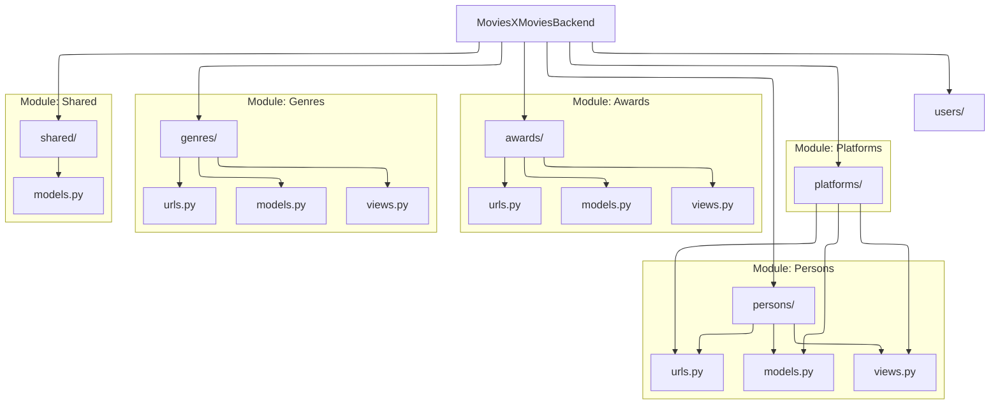

# Code Documentation

This section provides a detailed technical reference for the backend data models. All models inherit from our base utility classes to ensure data consistency.

## Architecture Overview
The following diagram illustrates the relationship between our base models and the domain-specific entities.

---

## Shared

Common utility classes and Mixins used across all application modules.

### Models

::: shared.models.BaseModel
    options:
      heading_level: 4
      show_root_heading: true

---

## Persons

Management of industry professionals, including actors, actresses, and directors.

### Models

::: persons.models.Person
    options:
      heading_level: 4
      show_root_heading: true

---

## Platforms

Streaming services and distribution channels documentation.

### Models

::: platforms.models.Platform
    options:
      heading_level: 4
      show_root_heading: true

---

## Awards

Industry recognitions, festivals, and cinematic awards.

### Models

::: awards.models.Award
    options:
      heading_level: 4
      show_root_heading: true

---

## Genres

Film categories and genre classifications.

### Models

::: genres.models.Genre
    options:
      heading_level: 4
      show_root_heading: true

---

## Users

Core user management, authentication, and profile data.

### Models

::: users.models.User
    options:
      heading_level: 4
      show_root_heading: true

## Movies

The base of the application, movies connected with almost everything

### Models

::: movies.models.Movie
    options:
      heading_level: 4
      show_root_heading: true

## Movie List

A list created by an user or administrator, with a privacy 

::: movielists.models.MovieList
    options:
      heading_level: 4
      show_root_heading: true

