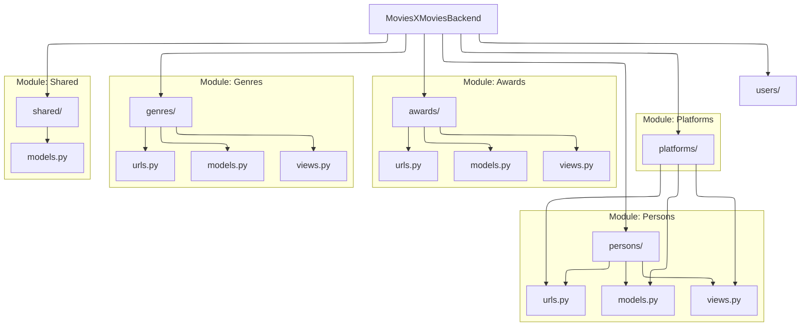

# Code Documentation

This section provides a detailed technical reference for the backend data models. All models inherit from our base utility classes to ensure data consistency.

## API Manual

This page contains all necesary documentation about API endpoints:
[API Documentation](https://moviesxmovies.jonaykb.com/api/docs/)

## Architecture Overview

The following diagram illustrates the relationship between our base models and the domain-specific entities.

---

## Main

### Urls
<!-- ::: main.urls
    options:
        heading_level: 4
        show_root_heading: true -->

## Shared

Common utility classes and Mixins used across all application modules.

### Models

::: shared.models.BaseModel
    options:
      heading_level: 4
      show_root_heading: true

::: shared.models.SoftDeleteQuerySet
    options:
      heading_level: 4
      show_root_heading: true

  
### Views

::: shared.views.GoogleLogin
    options:
      heading_level: 4
      show_root_heading: true

::: shared.views.CustomTokenObtainPairView
    options:
      heading_level: 4
      show_root_heading: true

### Serializer

::: shared.serializers.CustomTokenObtainPairSerializer
    options:
      heading_level: 4
      show_root_heading: true

::: shared.serializers.BaseSerializer
    options:
      heading_level: 4
      show_root_heading: true

---

## Persons

Management of industry professionals, including actors, actresses, and directors.

### Models

::: persons.models.Person
    options:
      heading_level: 4
      show_root_heading: true

---

## Platforms

Streaming services and distribution channels documentation.

### Models

::: platforms.models.Platform
    options:
      heading_level: 4
      show_root_heading: true

---

## Awards

Industry recognitions, festivals, and cinematic awards.

### Models

::: awards.models.Award
    options:
      heading_level: 4
      show_root_heading: true

---

## Genres

Film categories and genre classifications.

### Models

::: genres.models.Genre
    options:
      heading_level: 4
      show_root_heading: true

---

## Users

Core user management, authentication, and profile data.

### Models

::: users.models.User
    options:
      heading_level: 4
      show_root_heading: true

### Decorators

::: users.decorators.auth_required
    options:
      heading_level: 4
      show_root_heading: true

### Signals

::: users.signals.send_verification_email_on_created
    options:
      heading_level: 4
      show_root_heading: true

### Tasks

::: users.tasks.send_verification_email
    options:
      heading_level: 4
      show_root_heading: true

::: users.tasks.send_password_reset_email
    options:
      heading_level: 4
      show_root_heading: true

### Views

::: users.views.VerifyUserSerializer
    options:
      heading_level: 4
      show_root_heading: true

::: users.views.FollowResponse
    options:
      heading_level: 4
      show_root_heading: true

::: users.views.SignupUserSerializer
    options:
      heading_level: 4
      show_root_heading: true

::: users.views.UserUpdateSerializer
    options:
      heading_level: 4
      show_root_heading: true

::: users.views.ForgotPasswordResponse
    options:
      heading_level: 4
      show_root_heading: true

::: users.views.ForgotPasswordValidationSerializer
    options:
      heading_level: 4
      show_root_heading: true

::: users.views.ChangePreferredLanguageSerializer
    options:
      heading_level: 4
      show_root_heading: true

::: users.views.ChangePreferredLanguageResponse
    options:
      heading_level: 4
      show_root_heading: true

::: users.views.verify_user
    options:
      heading_level: 4
      show_root_heading: true

::: users.views.resend_verification_email
    options:
      heading_level: 4
      show_root_heading: true

::: users.views.suggested_users
    options:
      heading_level: 4
      show_root_heading: true

::: users.views.self_user_wrapper
    options:
      heading_level: 4
      show_root_heading: true

::: users.views.self_user_detail
    options:
      heading_level: 4
      show_root_heading: true

::: users.views.update_user
    options:
      heading_level: 4
      show_root_heading: true

::: users.views.forgot_password_wrapper
    options:
      heading_level: 4
      show_root_heading: true

::: users.views.forgot_password
    options:
      heading_level: 4
      show_root_heading: true

::: users.views.forgot_password_validation
    options:
      heading_level: 4
      show_root_heading: true

::: users.views.user_detail
    options:
      heading_level: 4
      show_root_heading: true

::: users.views.user_signup
    options:
      heading_level: 4
      show_root_heading: true

::: users.views.set_preferred_language
    options:
      heading_level: 4
      show_root_heading: true

::: users.views.user_reviews
    options:
      heading_level: 4
      show_root_heading: true

---

## Movies

The base of the application, movies connected with almost everything

### Models

::: movies.models.Movie
    options:
      heading_level: 4
      show_root_heading: true

### Tasks

::: movies.tasks.retrain_professional_model
    options:
      heading_level: 4
      show_root_heading: true

### Views

::: movies.views.ReviewSaveSerializer
    options:
      heading_level: 4
      show_root_heading: true

::: movies.views.RatingSaveSerializer
    options:
      heading_level: 4
      show_root_heading: true

::: movies.views.MoviesInListSerializer
    options:
      heading_level: 4
      show_root_heading: true

::: movies.views.movie_detail
    options:
      heading_level: 4
      show_root_heading: true

::: movies.views.movie_friends_ratings
    options:
      heading_level: 4
      show_root_heading: true

::: movies.views.movie_review_wrapper
    options:
      heading_level: 4
      show_root_heading: true

::: movies.views.movie_reviews
    options:
      heading_level: 4
      show_root_heading: true

::: movies.views.save_movie_review
    options:
      heading_level: 4
      show_root_heading: true

::: movies.views.movie_rating_wrapper
    options:
      heading_level: 4
      show_root_heading: true

::: movies.views.get_self_movie_rating
    options:
      heading_level: 4
      show_root_heading: true

::: movies.views.create_movie_rating
    options:
      heading_level: 4
      show_root_heading: true

::: movies.views.update_movie_rating
    options:
      heading_level: 4
      show_root_heading: true

::: movies.views.get_movie_recommendations
    options:
      heading_level: 4
      show_root_heading: true

::: movies.views._pad_with_algorithmic
    options:
      heading_level: 4
      show_root_heading: true

---

## Movie List

A list created by an user or administrator, with a privacy 

### Models

::: movielists.models.MovieList
    options:
      heading_level: 4
      show_root_heading: true

### Views

::: movielists.views.SaveMovieListSerializer
    options:
      heading_level: 4
      show_root_heading: true

::: movielists.views.movies_list_self_wrapper
    options:
      heading_level: 4
      show_root_heading: true

::: movielists.views.movies_list_self
    options:
      heading_level: 4
      show_root_heading: true

::: movielists.views.save_movie_list_self
    options:
      heading_level: 4
      show_root_heading: true

::: movielists.views._validate_intelligent_params
    options:
      heading_level: 4
      show_root_heading: true

::: movielists.views.movies_list_list
    options:
      heading_level: 4
      show_root_heading: true

::: movielists.views.movies_list_detail
    options:
      heading_level: 4
      show_root_heading: true

::: movielists.views.movies_list_movie_wrapper
    options:
      heading_level: 4
      show_root_heading: true

::: movielists.views.add_movie_to_list
    options:
      heading_level: 4
      show_root_heading: true

::: movielists.views.remove_movie_from_list
    options:
      heading_level: 4
      show_root_heading: true
