

## Color Palette

### Light mode

### Dark mode

## Fonts and sizes

Inter 5xl

Inter 4xl

Inter 3xl

Inter 2xl

Inter xl

Inter

Inter sm

Inter bold

## Components
### Button
=== "Light"
    <figure markdown="span">
    { loading=lazy }
    <figcaption>Button light</figcaption>
    </figure>

=== "Dark"
    <figure markdown="span">
    { loading=lazy }
    <figcaption>Button dark</figcaption>
    </figure>

 

=== "Light"
    <figure markdown="span">
    { loading=lazy }
    <figcaption>Button 2 light</figcaption>
    </figure>

=== "Dark"
    <figure markdown="span">
    { loading=lazy }
    <figcaption>Button 2 dark</figcaption>
    </figure>

### Search
<figure markdown="span">
{ loading=lazy }
<figcaption>Search</figcaption>
</figure>

### Search Fields 
=== "Light"
    <figure markdown="span">
    { loading=lazy }
    <figcaption>Search fields light</figcaption>
    </figure>

=== "Dark"
    <figure markdown="span">
    { loading=lazy }
    <figcaption>Search fields dark</figcaption>
    </figure>

### Navbar
=== "Light"
    <figure markdown="span">
    { loading=lazy }
    <figcaption>Navbar light</figcaption>
    </figure>

=== "Dark"
    <figure markdown="span">
    { loading=lazy }
    <figcaption>Navbar dark</figcaption>
    </figure>

### Stars
<figure markdown="span">
{ loading=lazy }
{ loading=lazy }
<figcaption>Stars</figcaption>
</figure>

### Pill
=== "Light"
    <figure markdown="span">
    { loading=lazy }
    <figcaption>Pill light</figcaption>
    </figure>

=== "Dark"
    <figure markdown="span">
    { loading=lazy }
    <figcaption>Pill dark</figcaption>
    </figure>

 

=== "Light"
    <figure markdown="span">
    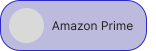{ loading=lazy }
    <figcaption>Pill 2 light</figcaption>
    </figure>

=== "Dark"
    <figure markdown="span">
    { loading=lazy }
    <figcaption>Pill 2 dark</figcaption>
    </figure>

### Badge
=== "Light"
    <figure markdown="span">
    { loading=lazy }
    <figcaption>Badge light</figcaption>
    </figure>

=== "Dark"
    <figure markdown="span">
    { loading=lazy }
    <figcaption>Badge dark</figcaption>
    </figure>

### Checkbox
<figure markdown="span">
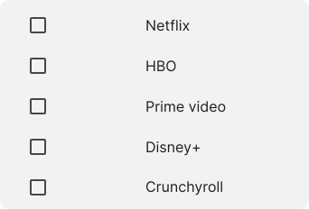{ loading=lazy }
<figcaption>Checkbox</figcaption>
</figure>

### Rating
=== "Light"
    <figure markdown="span">
    { loading=lazy }
    <figcaption>Rating light</figcaption>
    </figure>

=== "Dark"
    <figure markdown="span">
    { loading=lazy }
    <figcaption>Rating dark</figcaption>
    </figure>

### Review

=== "Light"
    <figure markdown="span">
    { loading=lazy }
    <figcaption>Review light</figcaption>
    </figure>

=== "Dark"
    <figure markdown="span">
    { loading=lazy }
    <figcaption>Review dark</figcaption>
    </figure>

 

=== "Light"
    <figure markdown="span">
    { loading=lazy }
    <figcaption>Review profile light</figcaption>
    </figure>

=== "Dark"
    <figure markdown="span">
    { loading=lazy }
    <figcaption>Review profile dark</figcaption>
    </figure>

### Following
=== "Light"
    <figure markdown="span">
    { loading=lazy }
    <figcaption>Following light</figcaption>
    </figure>

=== "Dark"
    <figure markdown="span">
    { loading=lazy }
    <figcaption>Following dark</figcaption>
    </figure>

 

=== "Light"
    <figure markdown="span">
    { loading=lazy }
    <figcaption>Follow light</figcaption>
    </figure>

=== "Dark"
    <figure markdown="span">
    { loading=lazy }
    <figcaption>Follow dark</figcaption>
    </figure>

### Actions
=== "Light"
    <figure markdown="span">
    { loading=lazy }
    <figcaption>More Info light</figcaption>
    </figure>

=== "Dark"
    <figure markdown="span">
    { loading=lazy }
    <figcaption>More Info dark</figcaption>
    </figure>

 

=== "Light"
    <figure markdown="span">
    { loading=lazy }
    <figcaption>More Info light</figcaption>
    </figure>

=== "Dark"
    <figure markdown="span">
    { loading=lazy }
    <figcaption>Not seen dark</figcaption>
    </figure>

 

=== "Light"
    <figure markdown="span">
    { loading=lazy }
    <figcaption>Add to List light</figcaption>
    </figure>

=== "Dark"
    <figure markdown="span">
    { loading=lazy }
    <figcaption>Add to List dark</figcaption>
    </figure>

### Movie
#### Movie cover
<figure markdown="span">
{ loading=lazy }
<figcaption>Movie cover</figcaption>
</figure>

#### New Movie
<figure markdown="span">
{ loading=lazy }
<figcaption>New Movie</figcaption>
</figure>

### Movie List
<figure markdown="span">

{ loading=lazy }
<figcaption>Movie List</figcaption>
</figure>

#### Add Movie List
<figure markdown="span">
{ loading=lazy }
<figcaption>Add Movie List</figcaption>
</figure>

=== "Light"
    <figure markdown="span">
    { loading=lazy }
    <figcaption>Blank Movie List light</figcaption>
    </figure>

=== "Dark"
    <figure markdown="span">
    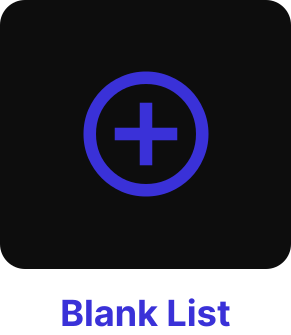{ loading=lazy }
    <figcaption>Blank Movie List dark</figcaption>
    </figure>

 

=== "Light"
    <figure markdown="span">
    { loading=lazy }
    <figcaption>Smart Movie List light</figcaption>
    </figure>

=== "Dark"
    <figure markdown="span">
    { loading=lazy }
    <figcaption>Smart Movie List dark</figcaption>
    </figure>

#### Movie List Checkbox
=== "Light"
    <figure markdown="span">
    { loading=lazy }
    <figcaption>Movie List Checkbox light</figcaption>
    </figure>

=== "Dark"
    <figure markdown="span">
    { loading=lazy }
    <figcaption>Movie List Checkbox dark</figcaption>
    </figure>

### Modals
#### Pop up
=== "Light"
    <figure markdown="span">
    { loading=lazy }
    <figcaption>Pop up light</figcaption>
    </figure>

=== "Dark"
    <figure markdown="span">
    { loading=lazy }
    <figcaption>Pop up dark</figcaption>
    </figure>

#### Create Movie List
=== "Light"
    <figure markdown="span">
    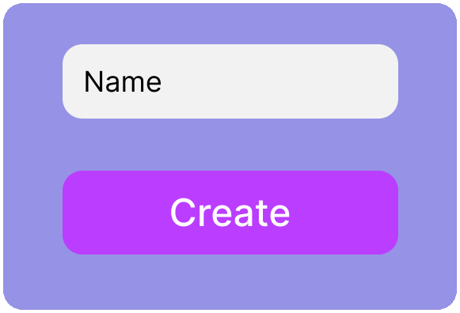{ loading=lazy }
    <figcaption>Blank List light</figcaption>
    </figure>

=== "Dark"
    <figure markdown="span">
    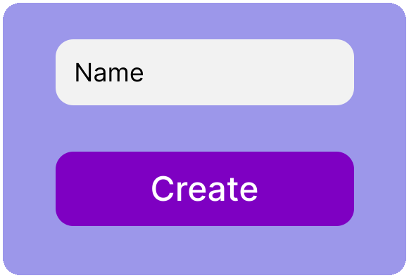{ loading=lazy }
    <figcaption>Blank List dark</figcaption>
    </figure>

 

=== "Light"
    <figure markdown="span">
    { loading=lazy }
    <figcaption>Smart List light</figcaption>
    </figure>

=== "Dark"
    <figure markdown="span">
    { loading=lazy }
    <figcaption>Smart List dark</figcaption>
    </figure>

#### Add to Movie List
=== "Light"
    <figure markdown="span">
    { loading=lazy }
    <figcaption>Add to Movie List light</figcaption>
    </figure>

=== "Dark"
    <figure markdown="span">
    { loading=lazy }
    <figcaption>Add to Movie List dark</figcaption>
    </figure>

## Pages
=== "Light"
    <figure markdown="span">
    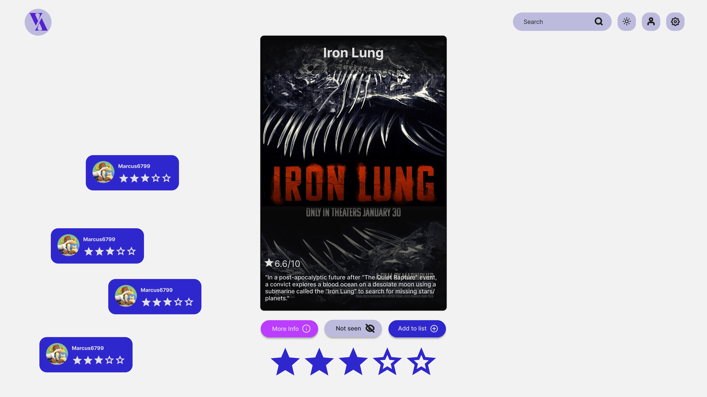{ loading=lazy }
    <figcaption>Home light</figcaption>
    </figure>

=== "Dark"
    <figure markdown="span">
    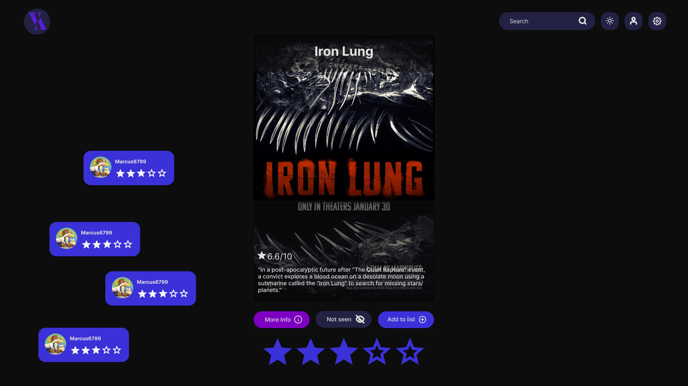{ loading=lazy }
    <figcaption>Home dark</figcaption>
    </figure>

 

=== "Light"
    <figure markdown="span">
    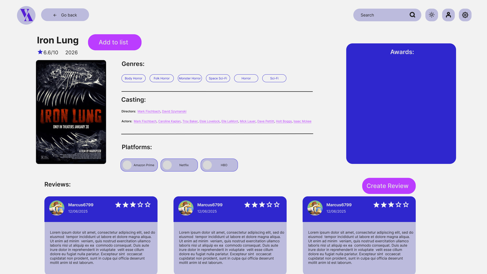{ loading=lazy }
    <figcaption>Movie Info light</figcaption>
    </figure>

=== "Dark"
    <figure markdown="span">
    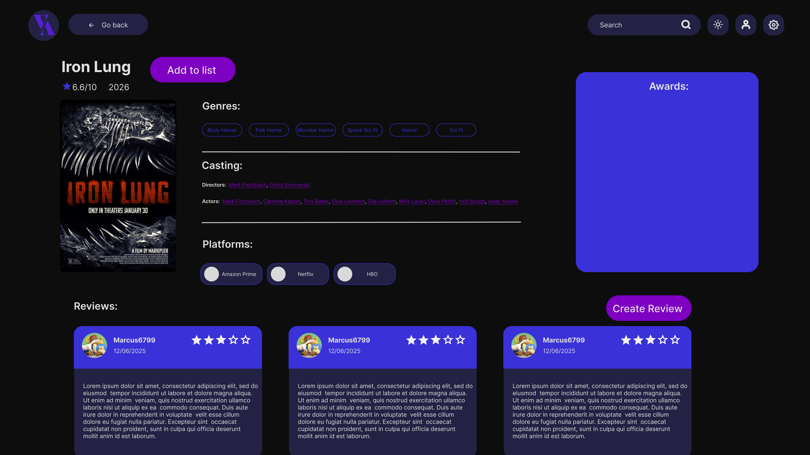{ loading=lazy }
    <figcaption>Movie Info dark</figcaption>
    </figure>

 

=== "Light"
    <figure markdown="span">
    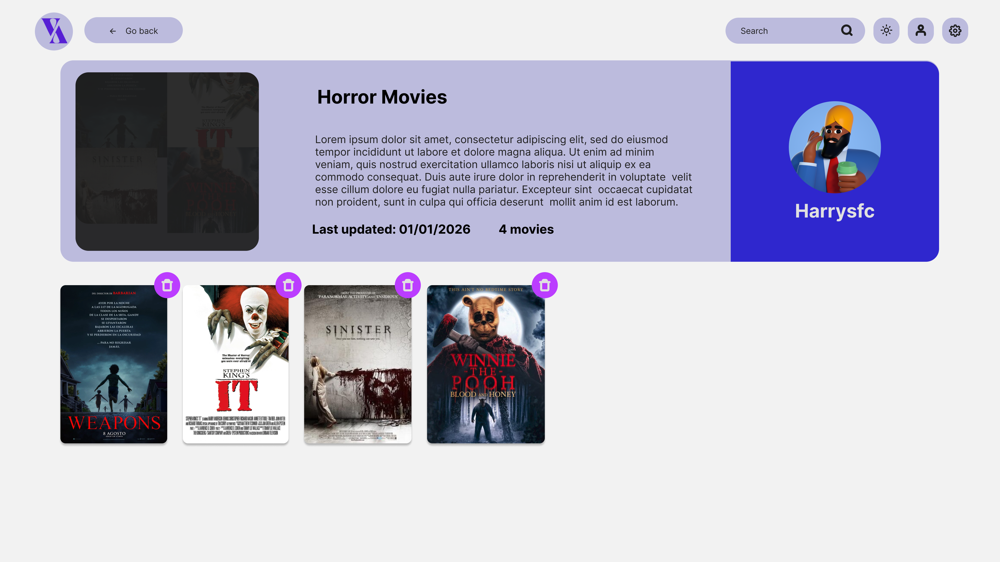{ loading=lazy }
    <figcaption>Movie List light</figcaption>
    </figure>

=== "Dark"
    <figure markdown="span">
    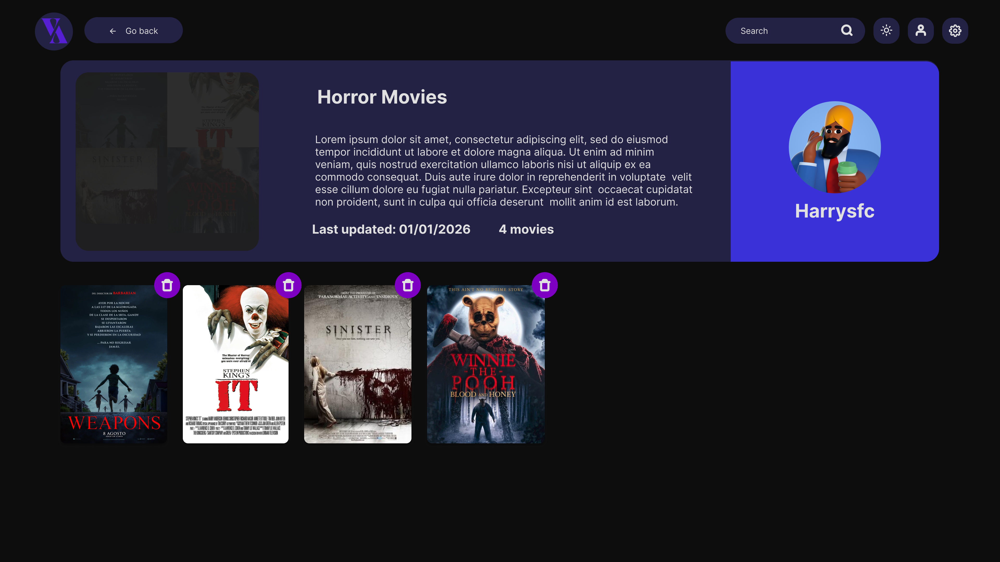{ loading=lazy }
    <figcaption>Movie List dark</figcaption>
    </figure>

 

=== "Light"
    <figure markdown="span">
    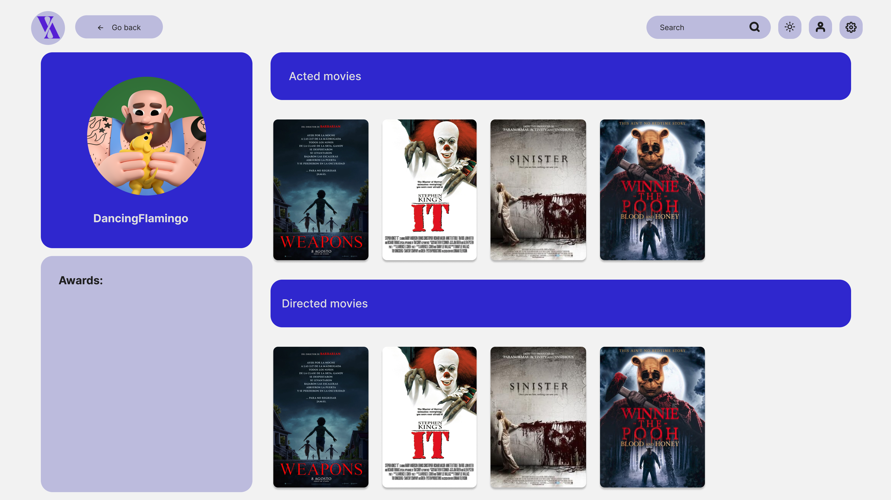{ loading=lazy }
    <figcaption>Person light</figcaption>
    </figure>

=== "Dark"
    <figure markdown="span">
    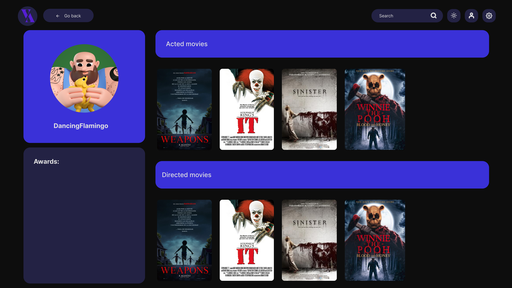{ loading=lazy }
    <figcaption>Person dark</figcaption>
    </figure>

 

=== "Light"
    <figure markdown="span">
    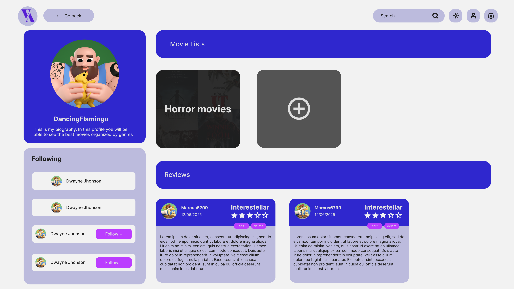{ loading=lazy }
    <figcaption>Profile light</figcaption>
    </figure>

=== "Dark"
    <figure markdown="span">
    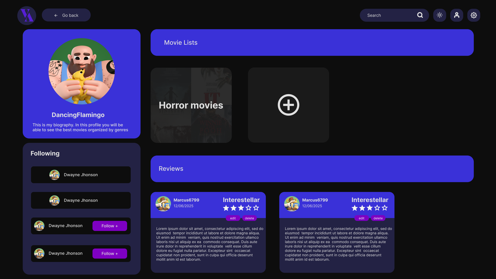{ loading=lazy }
    <figcaption>Profile dark</figcaption>
    </figure>

 

=== "Light"
    <figure markdown="span">
    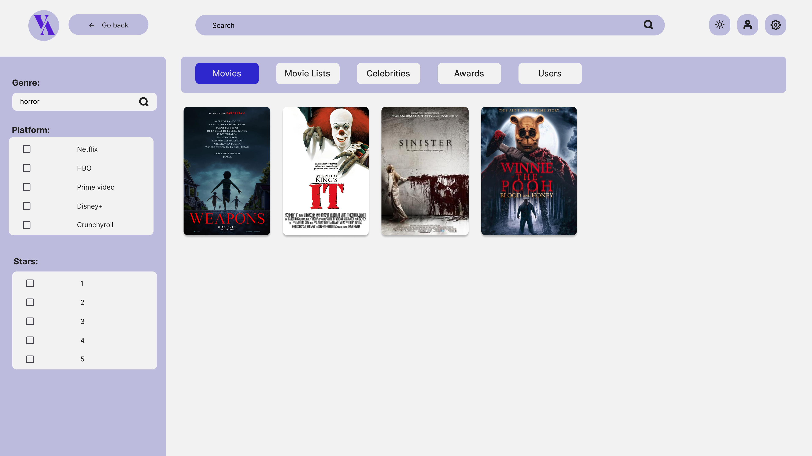{ loading=lazy }
    <figcaption>Search Results light</figcaption>
    </figure>

=== "Dark"
    <figure markdown="span">
    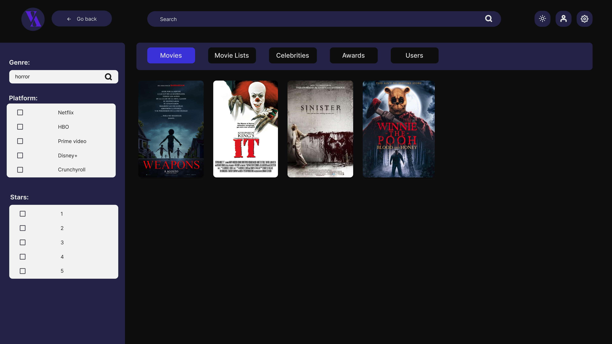{ loading=lazy }
    <figcaption>Search Results dark</figcaption>
    </figure>

 

=== "Light"
    <figure markdown="span">
    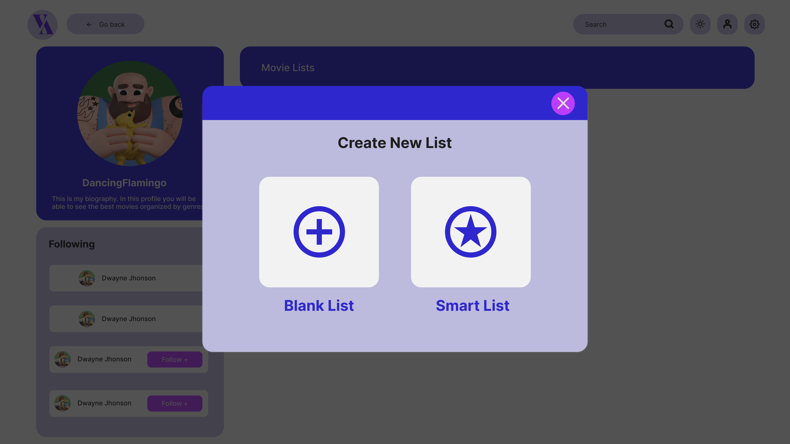{ loading=lazy }
    <figcaption>Select Create List light</figcaption>
    </figure>

=== "Dark"
    <figure markdown="span">
    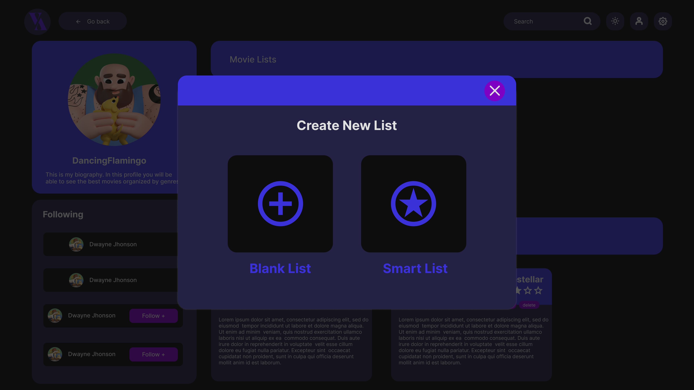{ loading=lazy }
    <figcaption>Select Create List dark</figcaption>
    </figure>

## Prototype
<iframe style="border: 1px solid rgba(0, 0, 0, 0.1);" width="800" height="450" src="https://embed.figma.com/proto/DngkWasn7sjCtRTMbUfqJh/MoviesXMovies?node-id=1-2&p=f&scaling=scale-down&content-scaling=fixed&page-id=0%3A1&embed-host=share" allowfullscreen></iframe>