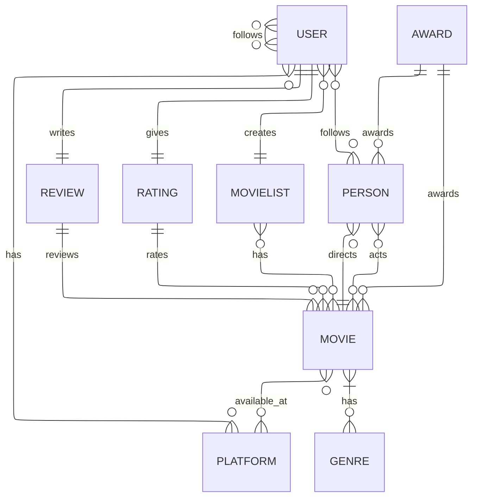
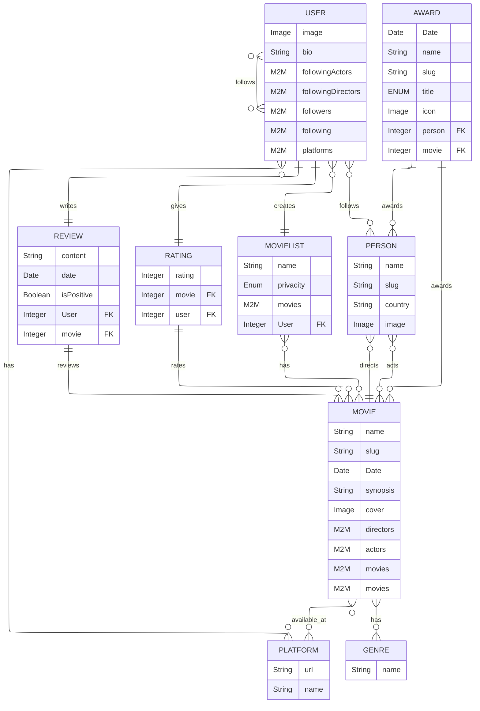

## Entity Relationship Diagram

```mermaid
---
config:
  layout: elk
---

erDiagram
    USER }o--o{ USER: follows
    USER ||--|| REVIEW: writes
    USER ||--|| RATING: gives
    USER }o--|| MOVIELIST: creates
    USER }o--o{ PERSON: follows
    USER }o--o{ PLATFORM: has
    PERSON }o--|| MOVIE: directs
    PERSON }o--o{ MOVIE: acts
    MOVIE }|--o{ GENRE: has
    MOVIE }o--o{ PLATFORM: available_at
    AWARD ||--o{ MOVIE: awards
    AWARD ||--o{ PERSON: awards
    MOVIELIST }o--o{ MOVIE: has
    RATING ||--o{ MOVIE: rates
    REVIEW ||--o{ MOVIE: reviews
```

## Class Diagram

```mermaid
---
config:
  layout: elk
---

erDiagram
    USER }o--o{ USER: follows
    USER ||--|| REVIEW: writes
    USER ||--|| RATING: gives
    USER }o--|| MOVIELIST: creates
    USER }o--o{ PERSON: follows
    USER }o--o{ PLATFORM: has
    PERSON }o--|| MOVIE: directs
    PERSON }o--o{ MOVIE: acts
    MOVIE }|--o{ GENRE: has
    MOVIE }o--o{ PLATFORM: available_at
    AWARD ||--o{ MOVIE: awards
    AWARD ||--o{ PERSON: awards
    MOVIELIST }o--o{ MOVIE: has
    RATING ||--o{ MOVIE: rates
    REVIEW ||--o{ MOVIE: reviews

    MOVIE {
        String name
        String slug
        Date Date
        String synopsis
        Image cover
        M2M directors
        M2M actors
        M2M movies
        M2M movies
    }
    GENRE {
        String name
    }
    PERSON {
        String name
        String slug
        String country
        Image image
    }
    AWARD {
        Date Date
        String name
        String slug
        ENUM title
        Image icon
        Integer person FK
        Integer movie FK
    }
    RATING {
        Integer rating
        Integer movie FK
        Integer user FK
    }
    USER {
        Image image
        String bio
        M2M followingActors
        M2M followingDirectors
        M2M followers
        M2M following
        M2M platforms
    }
    MOVIELIST {
        String name
        Enum privacity
        M2M movies
        Integer User FK
    }
    REVIEW {
        String content
        Date date
        Boolean isPositive
        Integer User FK
        Integer movie FK
    }
    PLATFORM {
        String url
        String name
    }
```

