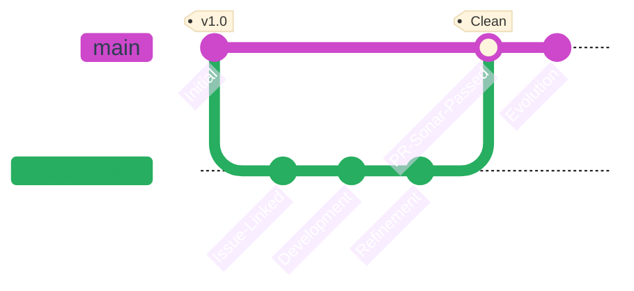

## Work Workflow

This document outlines the sacred path of our code, from the initial seed of an idea to the continuous evolution of the product.

---

## The Three Pillars (Architecture)
To maintain mental clarity and technical focus, we separate our world into three distinct realms.

| Realm          | Essence          | Responsibility                                                |
| :------------- | :--------------- | :------------------------------------------------------------ |
| 📄 **Docs**     | *The Root*       | Architecture, requirements, and the "Source of Truth."        |
| ⚙️ **Backend**  | *The Foundation* | Logic, data integrity, and the hidden strength of the system. |
| 🎨 **Frontend** | *The Flower*     | User experience, interface beauty, and interaction.           |

---

## The Flow of Purity
Every feature follows a disciplined journey. We do not rush; we refine.

### Git Lifecycle
<div align="center">


</div>

---

## The Developer's Creed

### Issue & Assignment
No code shall be written without a purpose. Every task begins as an **Issue**, providing a name and a face (assignee) to the intent.

### Branching & PR
Branches are private gardens. Work happens in isolation to ensure the `main` branch remains a sanctuary of stability.

!!! warning "The Guardian of Quality (SonarQube)"
    A Pull Request is a request for harmony. If the **SonarQube Quality Gate** fails (detecting bugs, vulnerabilities, or code smells), the gate remains closed. Only purified code may enter the main branch.

### The Infinite Loop
> "Completion is a milestone, not a destination."

We embrace the truth that a product is never "finished." We iterate, we polish, and we improve. Each merge is simply a new beginning for the next refinement.


**Status:** *In Continuous Evolution* 🔄

---

## Github Workflows

### Commons Workflows

Workflows ussed on all repositories

```yaml title="changelog.yml"
name: GitHub Changelog

on:
  push:
    branches:
      - main # (1)!
    paths:
      - 'pyproject.toml' # (2)!

jobs:
  release:
    runs-on: ubuntu-latest
    permissions:
      contents: write # (3)!
    steps:
      - name: Checkout code # (4)!
        uses: actions/checkout@v4
        with:
          fetch-depth: 0

      - name: Extract Version from pyproject.toml # (5)!
        id: get_version
        run: |
          VERSION=$(grep -m 1 '^version = ' pyproject.toml | cut -d '"' -f 2)
          echo "VERSION=$VERSION" >> $GITHUB_OUTPUT
          
      - name: Create GitHub Release # (6)!
        uses: softprops/action-gh-release@v1
        with:
          tag_name: v${{ steps.get_version.outputs.VERSION }}
          name: Release v${{ steps.get_version.outputs.VERSION }}
          generate_release_notes: true
        env:
          GITHUB_TOKEN: ${{ secrets.GITHUB_TOKEN }}
```
{ .annotate }

1. It only **deploys** if the branch is **main**
2. And if the file **pyproject.toml** has changed (1)
  {.annotate}

    1. In case of being **Frontend** project, it will be **package.json**

1. **Allows** github to **write** on the repo while executing the workflow
2. **Downloads** the code
3. Its **extracts** the **version** from the **project.toml** (1)
  {.annotate}

    1. In case of being **Frontend** project, it will be **package.json**
   
6. Adds the **release** to the **repository**

### Backend Workflows

Worflows executed on the backend (1)
{.annotate}

1. Also executes the [Common Workflows](#commons-workflows)

#### Sonarqube

#### Build

#### Deploy


### Frontend Workflows

Worflows executed on the frontend (1)
{.annotate}

1. Also executes the [Common Workflows](#commons-workflows)

#### Sonarqube

#### Build

#### Deploy

### Docs Workflows

Workflow of the documentation about MoviesXMovies

```yaml title="docs.yml"
name: Documentation
on:
  push:
    branches: # (1)!
      - master
      - main
    paths: # (2)!
      - 'zensical.toml'
      - 'docs/**'
      - '.github/workflows/docs.yml'
  repository_dispatch: # (3)!
    types: [backend_updated]
permissions: # (4)!
  contents: read
  pages: write
  id-token: write
jobs:
  deploy:
    environment:
      name: github-pages
      url: ${{ steps.deployment.outputs.page_url }}
    runs-on: ubuntu-latest
    steps:
      - uses: actions/configure-pages@v5
      - uses: actions/checkout@v5 # (5)!
      - name: Checkout Source Code # (6)!
        uses: actions/checkout@v4
        with:
          repository: moviesxmovies/moviesxmoviesBackend
          path: src_backend
      - name: Install uv # (7)!
        uses: astral-sh/setup-uv@v5
  
      - name: UV synchronize # (8)!
        run: uv sync

      - run: uv run zensical build --clean # (9)!
      - uses: actions/upload-pages-artifact@v4
        with:
          path: site
      - uses: actions/deploy-pages@v4 # (10)!
        id: deployment
```
{.annotate}

1. Only **deploys** if the branchs are **main** or **master** on **push**
2. And if **one** or **more** of this **paths** has **changed**
3. Also, if it **recieves** a `backend_updated` **signal**, it will **re-deploy**
4. **Sets** the following **permissions**
5. **Downloads** the repository (1)
  {.annotate}
  
    1. We need it to create **auto-generated** code **documentation**

6. **Downloads** base **Backend Code**
7. Installs **uv**
8. And creates **.venv**
9.  Then **builds** the files
10. And **upload** them on **github pages**