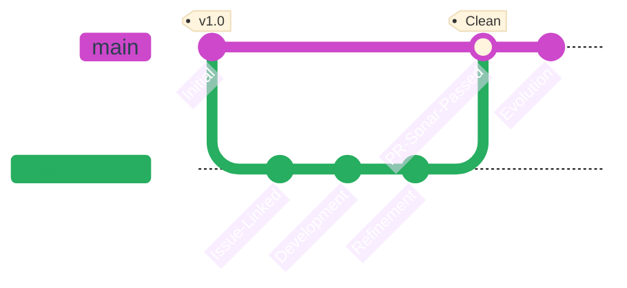

## Work Workflow

This document outlines the sacred path of our code, from the initial seed of an idea to the continuous evolution of the product.

---

## The Three Pillars (Architecture)
To maintain mental clarity and technical focus, we separate our world into three distinct realms.

| Realm          | Essence          | Responsibility                                                |
| :------------- | :--------------- | :------------------------------------------------------------ |
| 📄 **Docs**     | *The Root*       | Architecture, requirements, and the "Source of Truth."        |
| ⚙️ **Backend**  | *The Foundation* | Logic, data integrity, and the hidden strength of the system. |
| 🎨 **Frontend** | *The Flower*     | User experience, interface beauty, and interaction.           |

---

## The Flow of Purity
Every feature follows a disciplined journey. We do not rush; we refine.

### Git Lifecycle
<div align="center">


</div>

---

## The Developer's Creed

### Issue & Assignment
No code shall be written without a purpose. Every task begins as an **Issue**, providing a name and a face (assignee) to the intent.

### Branching & PR
Branches are private gardens. Work happens in isolation to ensure the `main` branch remains a sanctuary of stability.

!!! warning "The Guardian of Quality (SonarQube)"
    A Pull Request is a request for harmony. If the **SonarQube Quality Gate** fails (detecting bugs, vulnerabilities, or code smells), the gate remains closed. Only purified code may enter the main branch.

### The Infinite Loop
> "Completion is a milestone, not a destination."

We embrace the truth that a product is never "finished." We iterate, we polish, and we improve. Each merge is simply a new beginning for the next refinement.


**Status:** *In Continuous Evolution* 🔄

---

## Github Workflows

### Commons Workflows

Workflows ussed on all repositories

```yaml title="changelog.yml"
name: GitHub Changelog

on:
  push:
    branches:
      - main # (1)!
    paths:
      - 'pyproject.toml' # (2)!

jobs:
  release:
    runs-on: ubuntu-latest
    permissions:
      contents: write # (3)!
    steps:
      - name: Checkout code # (4)!
        uses: actions/checkout@v4
        with:
          fetch-depth: 0

      - name: Extract Version from pyproject.toml # (5)!
        id: get_version
        run: |
          VERSION=$(grep -m 1 '^version = ' pyproject.toml | cut -d '"' -f 2)
          echo "VERSION=$VERSION" >> $GITHUB_OUTPUT
          
      - name: Create GitHub Release # (6)!
        uses: softprops/action-gh-release@v1
        with:
          tag_name: v${{ steps.get_version.outputs.VERSION }}
          name: Release v${{ steps.get_version.outputs.VERSION }}
          generate_release_notes: true
        env:
          GITHUB_TOKEN: ${{ secrets.GITHUB_TOKEN }}
```
{ .annotate }

1. It only **deploys** if the branch is **main**
2. And if the file **pyproject.toml** has changed (1)
  {.annotate}

    1. In case of being **Frontend** project, it will be **package.json**

1. **Allows** github to **write** on the repo while executing the workflow
2. **Downloads** the code
3. Its **extracts** the **version** from the **project.toml** (1)
  {.annotate}

    1. In case of being **Frontend** project, it will be **package.json**
   
6. Adds the **release** to the **repository**

### Backend Workflows

Worflows executed on the backend (1)
{.annotate}

1. Also executes the [Common Workflows](#commons-workflows)

#### Sonarqube
```yaml title="sonarqube.yml"
name: Checks

on:
  push: # (1)!

  pull_request: # (2)!
    types: [opened, synchronize, reopened]
  
jobs:
  checks:
    name: Build and analyze 
    runs-on: ubuntu-latest
    steps:
      - uses: actions/checkout@v4 # (3)!
        with:
          fetch-depth: 0 

      - name: Set up Python # (4)!
        uses: actions/setup-python@v4
        with:
          python-version: '3.13'

      - name: Install uv # (5)!
        uses: astral-sh/setup-uv@v5
        with:
          enable-cache: true

      - name: Install dependencies # (6)!
        run: |
          uv sync

      - name: Run tests with coverage # (7)!
        run: |
          uv run pytest --rich --cov=./ --cov-report=xml --cov-report=html

      - uses: SonarSource/sonarqube-scan-action@v5 # (8)!
        env:
          SONAR_TOKEN: ${{ secrets.SONAR_TOKEN }}
          SONAR_HOST_URL: ${{ secrets.SONAR_HOST_URL }}

      - uses: SonarSource/sonarqube-quality-gate-action@v1 # (9)!
        timeout-minutes: 5
        env:
           SONAR_TOKEN: ${{ secrets.SONAR_TOKEN }}
```
{.annotate}

1. When **pushing** in any **branch**
2. And if a **PR** is **synchronizing**, **opening** or **reopening**
3. We **download** the **repository**
4. **Installing uv** to manage the dependencies
5. **Synchronizing** the dependencies
6. **Running tests**, and creating **coverage report**
7. **Pushing** data to **sonarqube**
8. If **quality gate** fails, the workflow will be tagged as **failed**

#### Build
```yaml title="build.yml"
name: Build Docker Image

on:
  workflow_run:
    workflows: ["Checks"] # (1)!
    types: [completed] # (2)!
    branches: [main]

jobs:
  build:
    name: Build and Tag Docker
    runs-on: ubuntu-latest
    if: ${{ github.event.workflow_run.conclusion == 'success' }} # (3)!

    steps:
      - uses: actions/checkout@v4 # (4)!

      - name: Install uv # (5)!
        uses: astral-sh/setup-uv@v5

      - name: Extract version from pyproject.toml # (6)!
        id: get_version
        run: |
          VERSION=$(uv tree --depth 0 | grep -oP '\Qv\E\K[0-9]+\.[0-9]+\.[0-9]+')
          echo "PROJECT_VERSION=$VERSION" >> $GITHUB_OUTPUT
          echo "Versión detectada: $VERSION"

      - name: Set up Docker Buildx # (7)!
        uses: docker/setup-buildx-action@v3

      - name: Login to Docker Hub # (8)!
        uses: docker/login-action@v3
        with:
          username: ${{ secrets.DOCKERHUB_USERNAME }}
          password: ${{ secrets.DOCKERHUB_TOKEN }}

      - name: Build and push # (9)!
        uses: docker/build-push-action@v5
        with:
          context: .
          push: true
          tags: |
            moviesxmovies/backend:${{ steps.get_version.outputs.PROJECT_VERSION }}
            moviesxmovies/backend:latest
```
{.annotate}

1. When **workflow "Checks"** is finished
2. And if a **Workflow** is **completed**
3. And if a **Workflow** is **completed**
4. We **download** the **repository**
5. **Installing uv** to ger version
6. **Obtaining** the version from `pyproject.toml`
7. **Seting up Docker Buildx**
8. **Login** on **Docker Hub**
9. **Pushing two tags**: `latest` and `version` tag
#### Deploy
```yaml title="deploy.yml"
name: Deploy

on:
    workflow_run:
        workflows: ["Build Docker Image"] # (1)!
        types: [completed]  # (2)!
        branches: [main] # (3)!

jobs:
    deploy:
        name: Deploy on server via SSH
        runs-on: ubuntu-latest
        if: ${{ github.event.workflow_run.conclusion == 'success' }} # (4)!
        steps:
            - name: executing remote ssh commands using password # (5)!
              uses: appleboy/ssh-action@master
              with:
                host: ${{ secrets.SSH_HOST }}
                username: ${{ secrets.SSH_USERNAME }}
                key: ${{ secrets.SSH_PRIVATE_KEY }}
                script: |
                  cd ${{ secrets.SSH_TARGET }}
                  docker compose down api
                  docker compose up -d --no-deps api
                  docker image prune -f
```
{.annotate}

1. When **workflow "Checks"** is finished
2. And if a **Workflow** is **completed**
3. And if **branch** is **main**
4. And if a **Workflow** is **completed**
5. We **connects** via **ssh** to the **server** and **execute** the following **commands**
      1. **Move** to the **project directory**
      2. **Down** the **API container**
      3. And **up** it updated, **without taking care** about the dependencies
      4. **Clean** the **unused images**
#### Update Docs
```yaml title="docs.yml"
name: Notify Docs Update
on:
  push:
    branches: [main, master] # (1)!

jobs:
  ping-docs:
    runs-on: ubuntu-latest
    steps:
      - name: Emit repository dispatch # (2)!
        run: |
          curl -X POST -u "${{ secrets.PAT_TOKEN }}" \
          -H "Accept: application/vnd.github.v3+json" \
          https://api.github.com/repos/moviesxmovies/moviesxmovies/dispatches \
          -d '{"event_type": "backend_updated"}'
```
{.annotate}

1. If the **branch** is **main** or **master**
2. **Sends** an **emit** to **moviesxmovies docs repository**

### Frontend Workflows

Worflows executed on the frontend (1)
{.annotate}

1. Also executes the [Common Workflows](#commons-workflows)

#### Sonarqube
```yaml title="sonar.yml"
name: Checks

on:
  push: # (1)!

  pull_request: # (2)!
    types: [opened, synchronize, reopened]

jobs:
  build:
    name: Build and analyze
    runs-on: ubuntu-latest

    steps:
      - name: Install Node.js # (3)!
        uses: actions/setup-node@v3
        with:
          node-version: "20.x"

      - name: Checkout code # (4)!
        uses: actions/checkout@v4

      - name: Install dependencies # (5)!
        run: npm ci

      - name: Run tests # (6)!
        run: npm run test:coverage

      - uses: SonarSource/sonarqube-scan-action@v5 # (7)!
        env:
          SONAR_TOKEN: ${{ secrets.SONAR_TOKEN }}
          SONAR_HOST_URL: ${{ secrets.SONAR_HOST_URL }}
      - uses: SonarSource/sonarqube-quality-gate-action@v1 # (8)!
        timeout-minutes: 5
        env:
          SONAR_TOKEN: ${{ secrets.SONAR_TOKEN }}
```
{.annotate}

1. When **pushing** in any **branch**
2. And if a **PR** is **synchronizing**, **opening** or **reopening**
3. **Installing node** to manage the dependencies and run code
4. We **download** the **repository**
5. **Synchronizing** the dependencies
6. **Running tests**, and creating **coverage report**
7. **Pushing** data to **sonarqube**
8. If **quality gate** fails, the workflow will be tagged as **failed**
#### Build
```yaml title="build.yml"
name: Build Docker Image

on:
  workflow_run:
    workflows: ["Checks"] # (1)!
    types: [completed] # (2)!
    branches: [main]

jobs:
  build:
    name: Build and Tag Docker
    runs-on: ubuntu-latest
    if: ${{ github.event.workflow_run.conclusion == 'success' }} # (3)!

    steps:
      - uses: actions/checkout@v4 # (4)!

      - name: Install npm # (5)!
        uses: actions/setup-node@v3
        with:
          node-version: "22"

      - name: Extract version from package.json # (6)!
        id: get_version
        run: |
          VERSION=$(jq -r '.version' package.json)
          echo "PROJECT_VERSION=$VERSION" >> $GITHUB_OUTPUT
          echo "Versión detectada: $VERSION"

      - name: Set up Docker Buildx # (7)!
        uses: docker/setup-buildx-action@v3

      - name: Login to Docker Hub # (8)!
        uses: docker/login-action@v3
        with:
          username: ${{ secrets.DOCKERHUB_USERNAME }}
          password: ${{ secrets.DOCKERHUB_TOKEN }}

      - name: Build and push # (9)!
        uses: docker/build-push-action@v5
        with:
          context: .
          push: true
          tags: |
            moviesxmovies/frontend:${{ steps.get_version.outputs.PROJECT_VERSION }}
            moviesxmovies/frontend:latest
```
{.annotate}

1. When **workflow "Checks"** is finished
2. And if a **Workflow** is **completed**
3. And if a **Workflow** is **completed**
4. We **download** the **repository**
5. **Installing node** to get version
6. **Obtaining** the version from `package.json`
7. **Seting up Docker Buildx**
8. **Login** on **Docker Hub**
9. **Pushing two tags**: `latest` and `version` tag
#### Deploy
```yaml title="deploy.yml"
name: Deploy

on:
  workflow_run:
    workflows: ["Build Docker Image"] # (1)!
    types: [completed] # (2)!
    branches: [main] # (3)!

jobs:
  deploy:
    name: Deploy on server via SSH
    runs-on: ubuntu-latest
    if: ${{ github.event.workflow_run.conclusion == 'success' }} # (4)!
    steps:
      - name: executing remote ssh commands using password # (5)!
        uses: appleboy/ssh-action@master
        with:
          host: ${{ secrets.SSH_HOST }}
          username: ${{ secrets.SSH_USERNAME }}
          key: ${{ secrets.SSH_PRIVATE_KEY }}
          script: |
            cd ${{ secrets.SSH_TARGET }}
            docker compose down web -v
            rm -rf /var/www/moviesxmovies/app/*
            docker compose up -d --no-deps web
            docker image prune -f
```
{.annotate}

1. When **workflow "Checks"** is finished
2. And if a **Workflow** is **completed**
3. And if **branch** is **main**
4. And if a **Workflow** is **completed**
5. We **connects** via **ssh** to the **server** and **execute** the following **commands**
      1. **Move** to the **project directory**
      2. **Down** the **WEB container**
      3. And **up** it updated, **without taking care** about the dependencies
      4. **Clean** the **unused images**
### Docs Workflows

Workflow of the documentation about MoviesXMovies

```yaml title="docs.yml"
name: Documentation
on:
  push:
    branches: # (1)!
      - master
      - main
    paths: # (2)!
      - 'zensical.toml'
      - 'docs/**'
      - '.github/workflows/docs.yml'
  repository_dispatch: # (3)!
    types: [backend_updated]
permissions: # (4)!
  contents: read
  pages: write
  id-token: write
jobs:
  deploy:
    environment:
      name: github-pages
      url: ${{ steps.deployment.outputs.page_url }}
    runs-on: ubuntu-latest
    steps:
      - uses: actions/configure-pages@v5
      - uses: actions/checkout@v5 # (5)!
      - name: Checkout Source Code # (6)!
        uses: actions/checkout@v4
        with:
          repository: moviesxmovies/moviesxmoviesBackend
          path: src_backend
      - name: Install uv # (7)!
        uses: astral-sh/setup-uv@v5
  
      - name: UV synchronize # (8)!
        run: uv sync

      - run: uv run zensical build --clean # (9)!
      - uses: actions/upload-pages-artifact@v4
        with:
          path: site
      - uses: actions/deploy-pages@v4 # (10)!
        id: deployment
```
{.annotate}

1. Only **deploys** if the branchs are **main** or **master** on **push**
2. And if **one** or **more** of this **paths** has **changed**
3. Also, if it **recieves** a `backend_updated` **signal**, it will **re-deploy**
4. **Sets** the following **permissions**
5. **Downloads** the repository (1)
  {.annotate}
  
    1. We need it to create **auto-generated** code **documentation**

6. **Downloads** base **Backend Code**
7. Installs **uv**
8. And creates **.venv**
9.  Then **builds** the files
10. And **upload** them on **github pages**